# CS464 Assignment 01 Mustafa Fawwaz BSSE23036

## Game 1: Shadow Fight 2

**Store link:** https://play.google.com/store/apps/details?id=com.nekki.shadowfight

**Genre:** Fighting / RPG

**Playtime:** 35 mintues

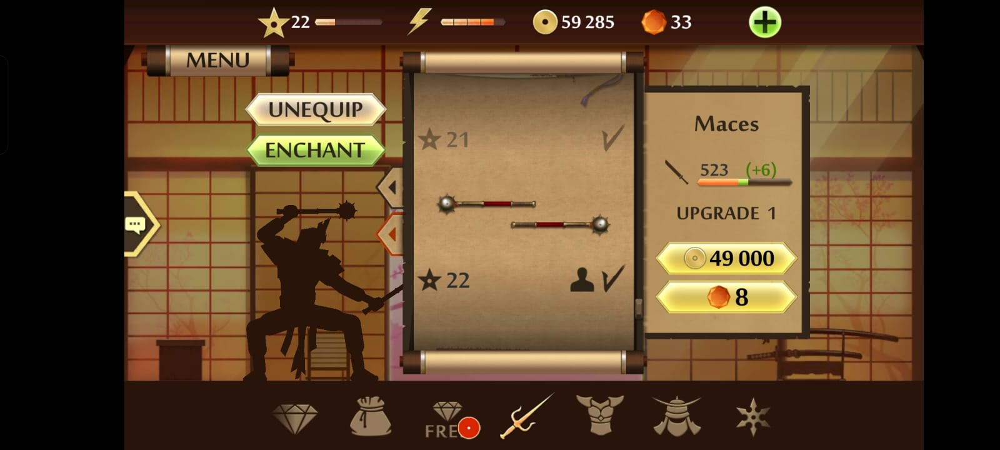
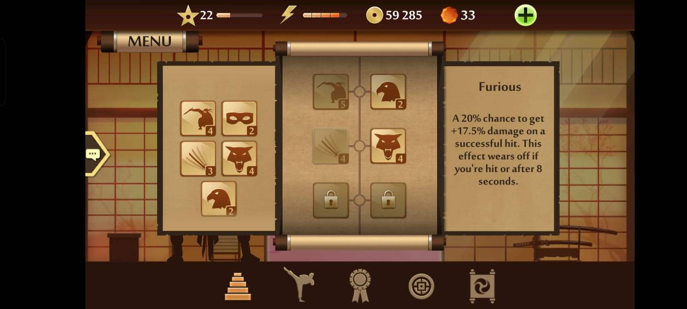
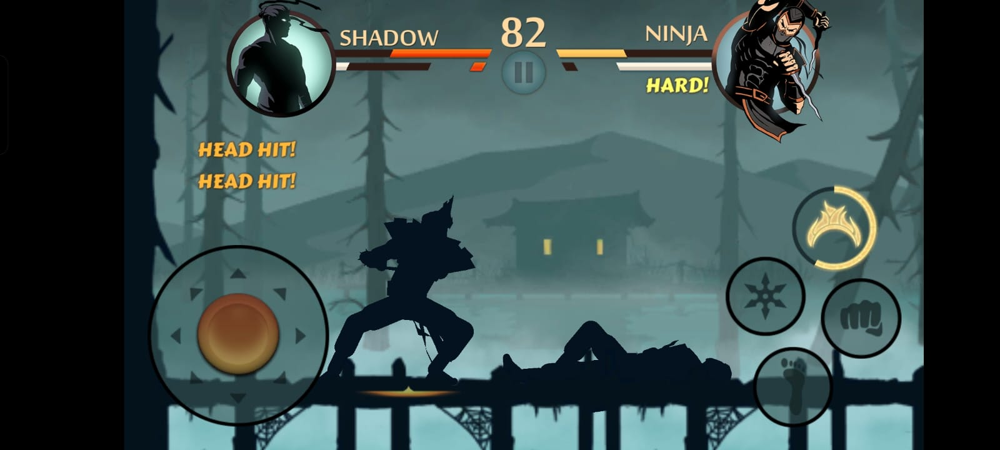
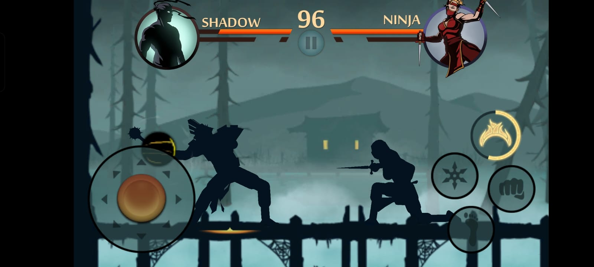

1. [M1, M2] [The energy meter at the top and the gear upgrade screen where coins are spent]
2. [M6] [The Skill Tree]
3. [M3] [Landing a Headhit multiplier]
4. [M5] [Triggering a Shadow Energy magic attack]

| Mechanic                                                                | Dynamic                                                                                      | Aesthetic                                                                       | Bartle type                                                            |
| ----------------------------------------------------------------------- | -------------------------------------------------------------------------------------------- | ------------------------------------------------------------------------------- | ---------------------------------------------------------------------- |
| **M1: Energy System** (Fights cost 1 energy; refills over real time)    | Players play in short bursts and wait hours to play again, fitting it around their schedule. | **Submission:** The game acts as a daily, low-friction pastime.                 | **Achiever:** A slow ladder of progression to climb.                   |
| **M2: Gear Upgrading** (Coins spent to increase base stats)             | Players grind repeatable modes to hoard coins when a boss is mathematically too difficult.   | **Challenge:** Overcoming a statistical obstacle by earning better gear.        | **Achiever:** Beating the game on its own terms by grinding stats.     |
| **M3: Positional Hit Multipliers** (Headhits deal bonus damage/shock)   | Players adopt defensive spacing to bait attacks and intentionally aim high strikes.          | **Sensation:** The visceral, visual reward of landing a heavy critical hit.     | **Explorer:** Finding out how the physics and weapon hitboxes work.    |
| **M4: Survival Mode** (Fight up to 10 opponents on a single health bar) | Players stop taking risks and use long-range, safe weapons to conserve health.               | **Challenge:** Testing endurance and mastery of safe combat.                    | **Achiever:** Conquering a specific game mode for maximum rewards.     |
| **M5: Shadow Energy** (Meter fills to cast unblockable spells)          | Players save magic for clutch moments to interrupt boss combos.                              | **Fantasy:** Fulfilling the make-believe role of a powerful shadow warrior.     | **Achiever:** Mastering a system to beat the game.                     |
| **M6: Skill Tree Perks** (Mutually exclusive passive buffs per level)   | Players test different perk combinations to optimize a build for their weapon.               | **Expression:** Discovering a fighting style that reflects personal preference. | **Explorer:** Tinkering with the RPG systems to see how they interact. |
| **M7: The Underworld Raids** (Group asynchronous boss damage)           | Players coordinate with clan members using high-DPS combos to rank high.                     | **Fellowship:** Teaming up with others to achieve a shared goal.                | **Killer:** Competing on a leaderboard to out-damage other players.    |

**Aesthetic profile:** The game leans most on **Challenge** and **Submission**. The core loop requires mastering difficult combat physics and survival stamina (Challenge), while the energy and upgrade economy forces the player to treat it as a background pastime they return to daily (Submission).

**Player types**
Primary: **Achievers** (**acting** on the **world**), because players impose their will on the game system by climbing a strict ladder of tournaments, leveling up, and upgrading gear to defeat the AI (M1, M2, M4, M5).
Secondary: **Explorers** (**interacting** with the **world**), because the joy of the combat lies in engaging with the simulation to find out how different weapon physics, attack ranges, and perk synergies work together (M3, M6).

## Game 2: Zombie Tsunami

**Store link:** https://play.google.com/store/apps/details?id=net.mobigame.zombietsunami

**Genre:** Endless Runner

**Playtime:** 20 minutes

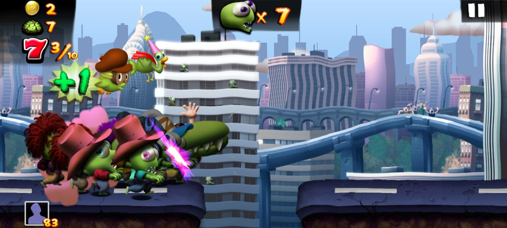
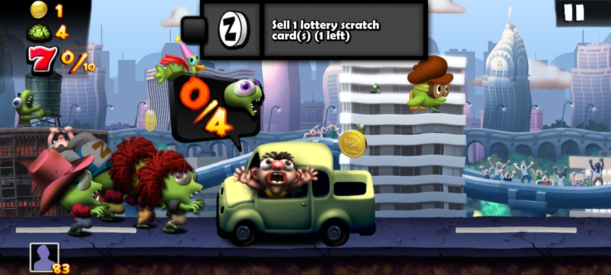
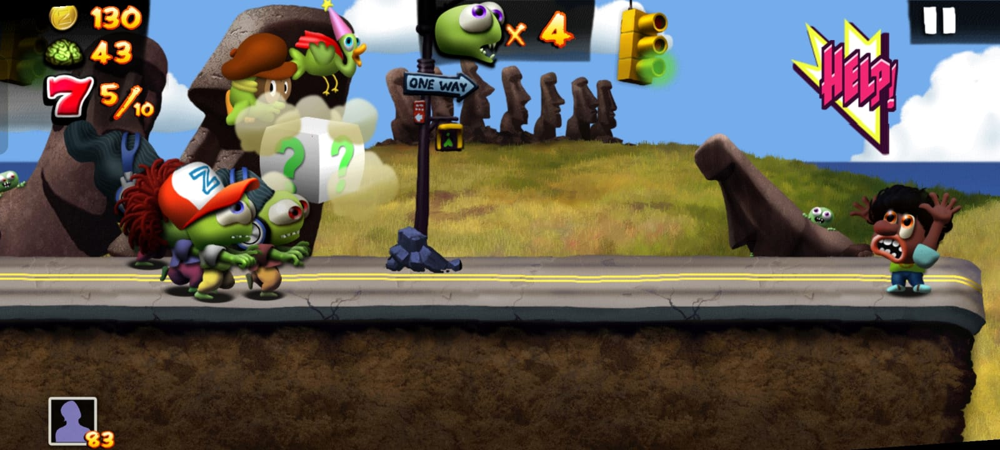
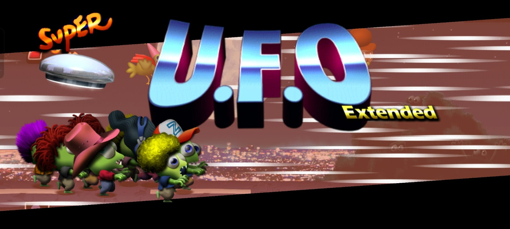

1. [M2] [A large horde of zombies jumping a gap and infecting a standing civilian]
2. [M3] [The horde flipping a 4-zombie bus threshold]
3. [M5] [e.g., The horde using a '?' box transformation]
4. [M5] [e.g., The horde activating the transformation after using the box]

| Mechanic                                                                  | Dynamic                                                                                             | Aesthetic                                                                          | Bartle type                                                                      |
| ------------------------------------------------------------------------- | --------------------------------------------------------------------------------------------------- | ---------------------------------------------------------------------------------- | -------------------------------------------------------------------------------- |
| **M1: Variable-Duration Jump** (Hold input to jump wider/longer)          | Players gauge jump lengths based on horde size to keep trailing zombies from falling.               | **Sensation:** Sense-pleasure from the rhythmic, visual wave motion of the mob.    | **Achiever:** Beating physics obstacles through precise motor inputs.            |
| **M2: Civilian Infection** (Touching civilians converts them to zombies)  | Players greedily hunt down civilians to increase their buffer against hazards.                      | **Fantasy:** Make-believe empowerment of leading an unstoppable outbreak.          | **Achiever:** Maximizing a visible numerical counter as a measure of success.    |
| **M3: Vehicle Thresholds** (Requires X zombies to flip cars/buses)        | Players do split-second math to either crash into vehicles for rewards or jump them to survive.     | **Challenge:** Fast numerical risk calculation under continuous movement pressure. | **Achiever:** Overcoming high-tier structural hurdles to secure optimal payouts. |
| **M4: Zero-Count Loss** (Run ends only when the zombie count hits 0)      | Players treat excess zombies as expendable shields, sacrificing them to landmines.                  | **Challenge:** Managing an attrition buffer to survive as long as possible.        | **Achiever:** Acting on the game system to achieve personal best distances.      |
| **M5: Mystery Box Transformations** ('?' grants complete invulnerability) | Players switch from cautious jumping to aggressively destroying every obstacle.                     | **Fantasy:** Extreme empowerment of steamrolling previously deadly obstacles.      | **Explorer:** Experimenting with how mutations interact with obstacles.          |
| **M6: Potion Vial Missions** (Complete 3 modular tasks to level up)       | Players alter their survival strategy to force specific sub-goals, sacrificing runs for objectives. | **Challenge:** A structured checklist of constraints testing targeted skills.      | **Achiever:** Climbing an explicit level ladder and ticking off milestones.      |
| **M7: 100-Brain Lottery** (Collect 100 brains for a scratch ticket)       | Players grind out "just one more run" specifically to trigger the lottery reveal.                   | **Submission:** A low-friction pastime loop driven by routine collection.          | **Achiever:** Working toward an incremental reward threshold.                    |

**Aesthetic profile:** The game leans on **Fantasy** and **Challenge**. It fulfills the chaotic power fantasy of growing an unstoppable undead wave (Fantasy), while the core loop demands instant arithmetic and reaction time under increasing speed to manage the horde size (Challenge).

**Player types**
Primary: **Achievers** (**acting** on the **world**), because the game revolves around imposing on the system to increase quantifiable metrics: expanding the horde counter, overturning high-tier vehicles, and climbing potion ranks (M2, M3, M6).
Secondary: **Explorers** (**interacting** with the **world**), because players experiment directly with the mechanics to discover how different '?' box transformations behave and test the limits of variable jumps across different horde sizes (M1, M5).

## Level blockouts

| Level   | Screenshot                                      | Its idea                                                                                                | Wayfinding tool                                                                |
| ------- | ----------------------------------------------- | ------------------------------------------------------------------------------------------------------- | ------------------------------------------------------------------------------ |
| Level01 | 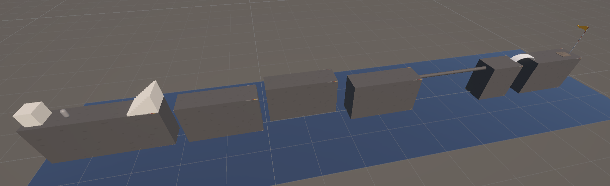 | A horizontal tactical maze with 1.5m doorways forcing blind exploration into side rooms.                | Landmark (a visually distinct central pillar guiding the main path).           |
| Level02 | 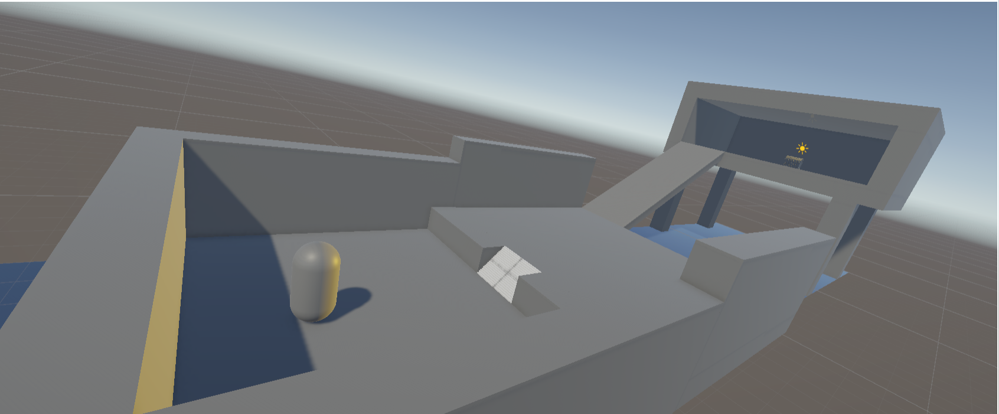 | A vertical tech atrium using 45-degree ramps and 3m jump gaps to test controller limits.                | Light and contrast (a single point light highlighting the upper catwalk goal). |
| Level03 | 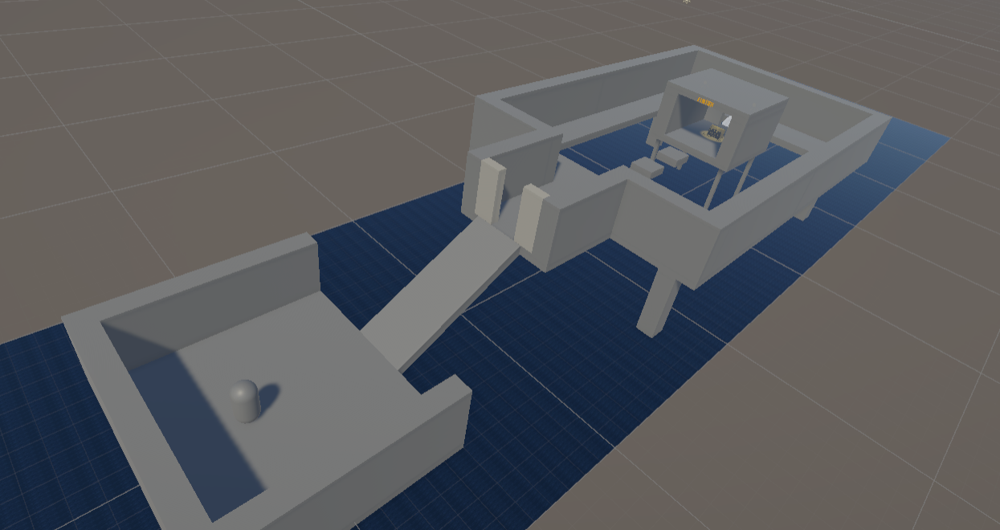 | A split-route arena where the player chooses between a safe long path or a risky jumping shortcut.      | Leading lines (floor geometry visually pointing toward the correct exit).      |
| Level04 | 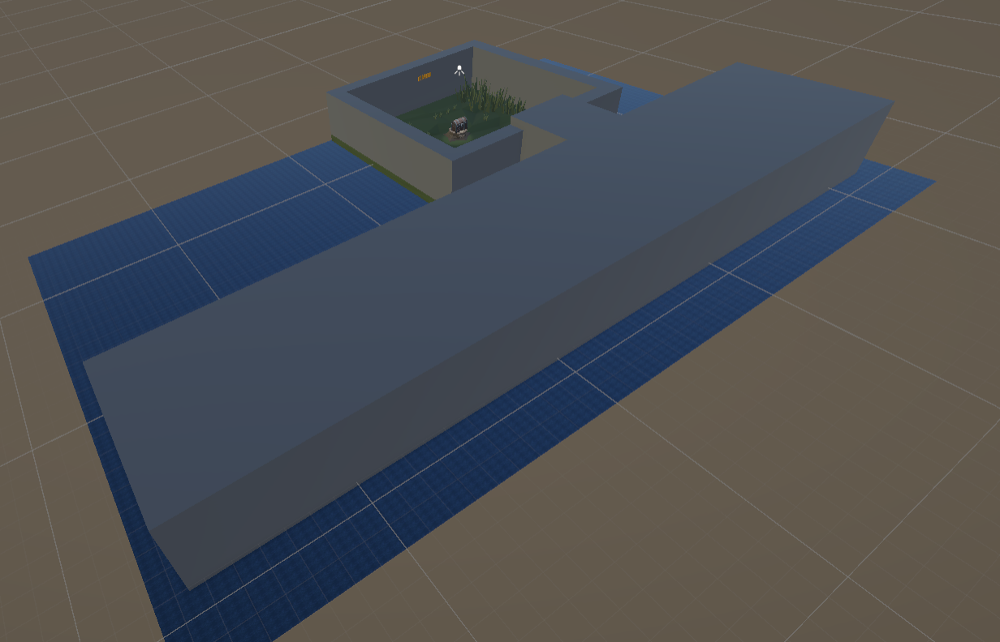 | A claustrophobic crawl utilizing 1.2m cover blocks to force a pinch before opening into a large reveal. | Pinch and release (tight spatial constraints exploding into an open yard).     |
| Level05 | 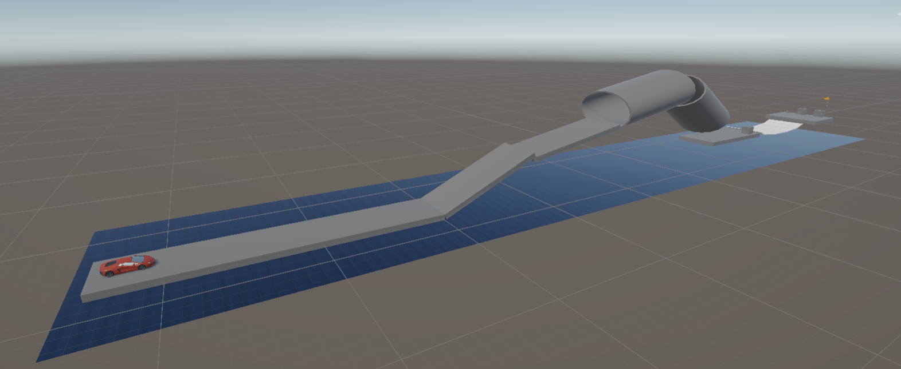 | A high-risk balancing act across narrow cylinder bridges suspended above a bottomless floor.            | Breadcrumbs (a trail of small cubes leading across the safest path).           |
